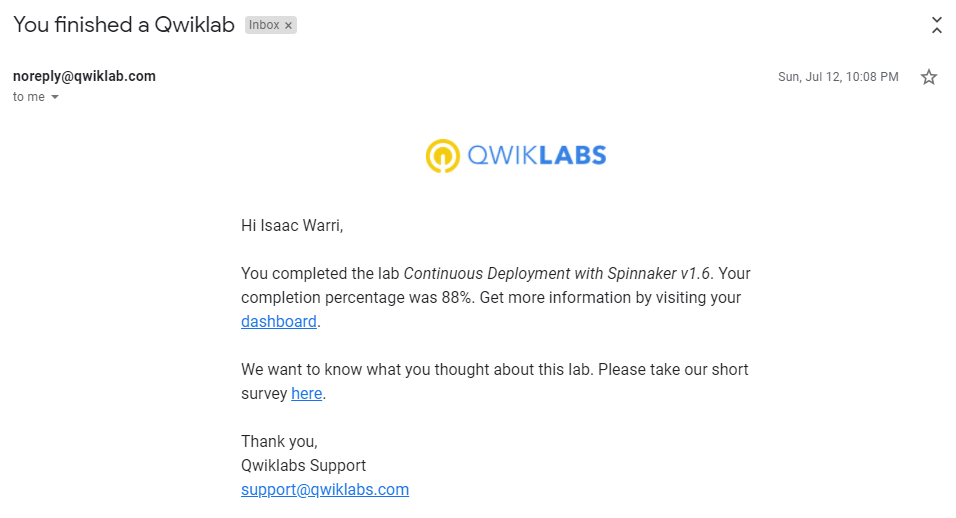

# Google-Cloud-QwikLabs
## Below are some of the screenshots of QwikLabs in the course of my Learning Journey

### 1. **Console and Cloud Shell:**

### 2. App Dev Setting up a Development Environment v1.1

### 3. Automating the Deployment of Infrastructure Using Terraform

### 4. Cloud Fundamentals- Getting Started with Cloud Marketplace

### 5. Continuous Deployment with Jenkins v1.6

### 6. Continuous Deployment with Spinnaker v1.6

### 7. Creating Virtual Machines 

### 8. Explore a BigQuery Public Dataset

### 9. Google Cloud Fundamentals- Getting Started with GKE

### 10. Error Reporting and Debugging

### 11. VPC Networking

### 12. Configuring an Internal Load Balancer

### 13. Introduction to Containers and Docker v1.6

### 14. Google Cloud Fundamentals- Getting Started with Compute Engine

### 15. Google Cloud Fundamentals- Getting Started with Deployment Manager and Cloud Monitoring

